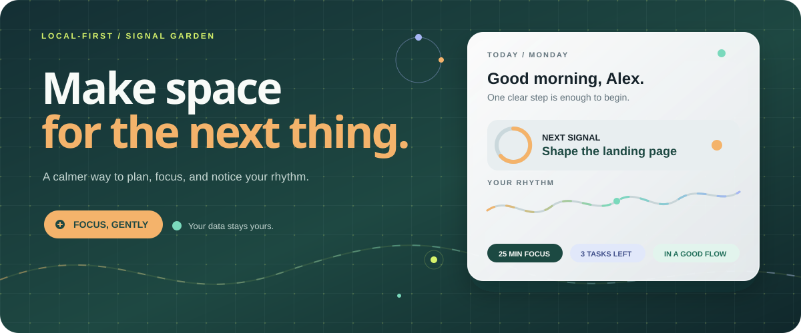

<h1 align="center">EiFlow</h1>

<p align="center">
  
</p>

<p align="center">
  <strong>A calmer operating system for your attention.</strong><br />
  Make the next thing clear, protect space for focus, and notice the patterns that help.
</p>

<p align="center">
  <a href="https://github.com/EternalWhiskers/Ei-flow/releases/latest/download/eiflow.apk"></a>
  <a href="https://github.com/EternalWhiskers/Ei-flow/releases"></a>
</p>

<p align="center">
  <a href="#install-on-android">Install on Android</a>
  <span aria-hidden="true"> · </span>
  <a href="#run-the-web-app">Run the web app</a>
  <span aria-hidden="true"> · </span>
  <a href="#what-is-inside">Explore features</a>
</p>

## Install directly on Android

No archive to extract. Download the APK and install it directly:

**[Download the latest EiFlow APK](https://github.com/EternalWhiskers/Ei-flow/releases/latest/download/eiflow.apk)**

1. Tap the download link on your Android device.
2. Open the downloaded `eiflow.apk` file.
3. If Android asks, allow your browser or file manager to install unknown apps.
4. Confirm the installation and open EiFlow.

EiFlow supports **Android 7.0 and newer**. The automated GitHub release is debug-signed for evaluation; it is not a Google Play production package. A future store release should use an organization-owned release keystore and protected GitHub Actions secrets.

## The idea

EiFlow treats attention like a signal garden rather than a queue of obligations. The interface keeps one decision in view while the rest of the day stays visible at the edge.

| Make the next thing clear | Protect space for focus | Notice the patterns |
| --- | --- | --- |
| Tasks, goals, and due dates become an actionable today view. | A flexible focus timer turns intention into a protected session. | Analytics connect habits, energy, goals, and your best working rhythm. |

## What is inside

- **Today dashboard** — greeting, score, tasks, schedule, habits, goals, and a focused next action.
- **Task workspace** — list and board views with search, filters, priorities, due dates, drag-and-drop movement, and detail editing.
- **Habit rhythm** — frequency targets, check-ins, current and best streaks, weekly grids, and progress details.
- **Goals with momentum** — milestones, target dates, statuses, categories, and automatic progress.
- **Weekly planner** — deep work, meetings, exercise, personal, and study blocks that stay distinct from due tasks.
- **Focus sessions** — 25, 45, or 60-minute timer presets with optional task and goal linking.
- **Reflection** — 7-day and 30-day analytics for tasks, habits, focus, goals, best day, and best time.
- **A considerate shell** — light, dark, and system themes, responsive navigation, keyboard-visible focus, and reduced-motion support.

## Local first, by design

Your workspace stays in the browser's local storage. EiFlow requires no account, API key, external database, authentication provider, or network connection for daily use.

Use **Settings → Export all data** for a portable JSON backup. Imports validate record shape, unique identifiers, and cross-record references before replacing the current workspace; invalid files leave existing data untouched.

## Run the web app

Requirements: **Node.js 22+** and npm.

```bash
npm ci
npm run dev
```

Open the local URL printed by Vite. Verify a production build with:

```bash
npm run build
npm run preview
```

## Release channel

The public repository is [EternalWhiskers/Ei-flow](https://github.com/EternalWhiskers/Ei-flow). Every semantic-version tag such as `v1.0.1` audits dependencies, builds the web app, synchronizes Capacitor, assembles the Android app, and publishes:

- **`eiflow.apk`** — the direct Android installer; the stable link always points to the newest release.
- **`SHA256SUMS`** — a checksum file for verifying the downloaded APK.

Useful links:

- [Download the latest APK](https://github.com/EternalWhiskers/Ei-flow/releases/latest/download/eiflow.apk)
- [View all releases](https://github.com/EternalWhiskers/Ei-flow/releases)
- [Browse the source](https://github.com/EternalWhiskers/Ei-flow/tree/main)

To publish a release after pushing the repository:

```bash
git tag v1.0.1
git push origin v1.0.1
```

## Architecture

- **React + TypeScript + Vite** provide the application runtime and type-safe component model.
- **Tailwind CSS** supplies the responsive visual system; `src/index.css` contains design tokens, dark-mode overrides, grid texture, and reduced-motion behavior.
- **Local-first state** is held in a single typed `AppState` object and persisted with `src/hooks/useLocalStorage.ts` under `eiflow-state-v1`.
- **Seeded demo data** lives in `src/data.ts`, with dates generated relative to the current day so the demo stays useful after refreshes.
- **Reusable UI primitives** are in `src/components/ui.tsx`; navigation and common display patterns are in `src/components/common.tsx`.
- **Product views** are split into `dashboard.tsx`, `tasks.tsx`, and `flow-views.tsx`; `App.tsx` owns state transitions and page routing.

## License

EiFlow is released under the [MIT License](LICENSE), copyright © 2026 EternalWhiskers.
